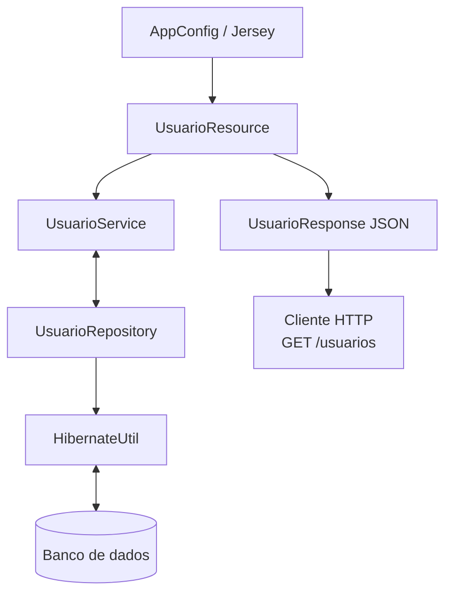

# api-bike

API Java para consulta de usuários, construída com **Jersey + tomcat** na camada HTTP e **Hibernate** na camada de persistência.

O projeto expõe o endpoint `GET /usuarios`, consulta a tabela `usuario` no PostgreSQL e devolve os dados em formato JSON.

Vou seguir o padrão REST, sem estado, em camadas.

## Objetivo

Este projeto implementa uma API simples com separação por camadas:

- **Resource**: recebe a requisição HTTP
- **Service**: aplica a regra de negócio e transforma os dados
- **Repository**: acessa o banco via Hibernate
- **Entity / Response DTO**: representam os dados persistidos e o payload de saída

## Stack

- Java
- Maven
- Jersey (JAX-RS)
- Tomcat 9
- Hibernate ORM
- PostgreSQL
- Jackson para serialização JSON

## Configuração do banco

Arquivo de exemplo:

```properties  
# src/main/resources/hibernate.properties.example  

db.url=jdbc:postgresql://localhost:5432/bikes  
db.user=postgres  
db.password=postgres  
```  

* o banco deve existir antes de subir a aplicação
* a tabela `usuario` deve estar criada e populada

## 9. Rodando pelo terminal

Gerar o WAR:

```bash
mvn clean package
```

Saída esperada em `target/`.

Exemplo:

```text
target/api-bike-1.0-SNAPSHOT.war
```

Para deploy manual no Tomcat:

```bash
cp target/api-bike-1.0-SNAPSHOT.war $CATALINA_HOME/webapps/
```

Depois suba o Tomcat:

```bash
$CATALINA_HOME/bin/startup.sh
```


## Endpoint disponível

### Listar usuários

```http  
GET /usuarios  
```  

Exemplo de chamada:

```bash  
curl http://localhost:8080/api-bike/usuarios
```  

Exemplo de resposta esperada:

```json
{  
  "usuarios": ["Ana", "Bruno", "Carlos"]
}  
```  

## Fluxo da requisição

1. `AppConfig` registra os recursos JAX-RS
2. Uma requisição `GET /usuarios` chega em `UsuarioResource`
3. `UsuarioResource` chama `UsuarioService`
4. `UsuarioService` solicita os dados ao `UsuarioRepository`
5. `UsuarioRepository` abre uma `Session` via `HibernateUtil`
6. O Hibernate consulta a entidade `Usuario`
7. O resultado é transformado em `UsuarioResponse`
8. O Jackson serializa o DTO para JSON na resposta HTTP

## Arquitetura

O diagrama abaixo mostra as relações principais entre as classes do projeto.




## Responsabilidade de cada classe

### `AppConfig`
Configura o Jersey, define os pacotes a serem escaneados e registra o suporte a JSON.

### `UsuarioResource`
Camada HTTP da API. Expõe o endpoint `/usuarios`.

### `UsuarioService`
Camada de negócio. Orquestra a busca dos usuários e prepara os dados para resposta.

### `UsuarioRepository`
Camada de acesso a dados. Executa a consulta Hibernate para recuperar os registros da entidade `Usuario`.

### `HibernateUtil`
Centraliza a criação do `SessionFactory` e o carregamento das propriedades de conexão com o banco.

### `Usuario`
Entidade JPA/Hibernate mapeada para a tabela `usuario`.

### `UsuarioResponse`
DTO usado para estruturar a resposta JSON do endpoint.
