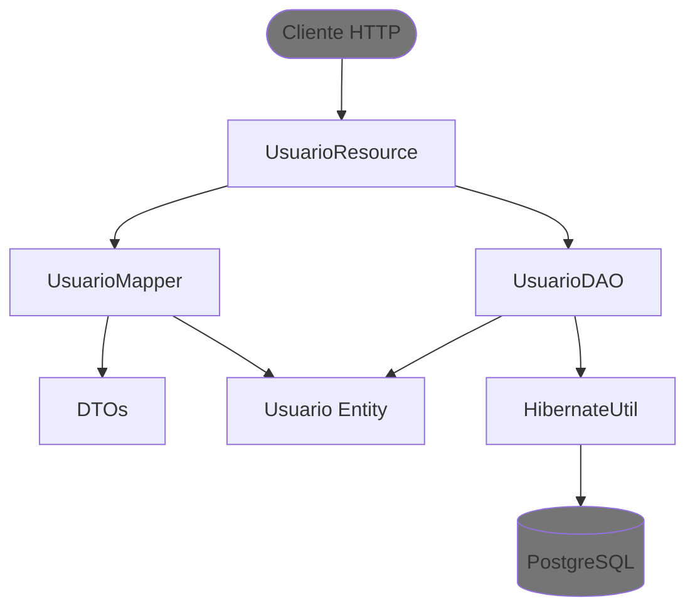

# api-legado

API Java simples para estudo de uma stack legada baseada em **Java 8**, **Jersey (JAX-RS)**, **Hibernate ORM** e **Tomcat**.

O projeto expõe endpoints HTTP para listar e criar usuários persistidos em PostgreSQL. A aplicação monoítica está organizada em uma separação enxuta entre camada HTTP, mapeamento de DTOs e acesso a dados.

A estrutura atual do projeto é esta:

- **DTOs**: representam os payloads da API
- **Resource**: recebe a requisição HTTP e monta a resposta
- **DAO**: acessa o banco usando Hibernate
- **Entity**: representa a tabela persistida
- **Mapper**: converte DTOs de entrada/saída para a entidade e vice-versa

## Stack

- Java 8
- Maven
- Jersey 2.x (JAX-RS)
- Jackson
- Hibernate 5.x
- PostgreSQL
- Tomcat 9
- Lombok

## Configuração do banco

Arquivo de exemplo:

```properties  # src/main/resources/hibernate.properties.example    
db.url=jdbc:postgresql://localhost:5432/bikes  db.user=postgres  db.password=postgres    
```    
* o banco deve existir antes de subir a aplicação
* a tabela `usuario` deve estar criada e populada

## 9. Rodando pelo terminal

Gerar o WAR:

```bash  
mvn clean package```  
  
Saída esperada em `target/`.  
  
Exemplo:  
  
```text  
target/api-legado-1.0-SNAPSHOT.war  
```  

Para deploy manual no Tomcat:

```bash  
cp target/api-legado-1.0-SNAPSHOT.war $CATALINA_HOME/webapps/```  
  
Depois suba o Tomcat:  
  
```bash  
$CATALINA_HOME/bin/startup.sh  
```  

## Fluxo da requisição

1. A requisição chega em `UsuarioResource`
2. A `Resource` converte o DTO de entrada usando `UsuarioMapper`
3. A `Resource` chama `UsuarioDAO`
4. O `DAO` usa `HibernateUtil` para abrir uma `Session`
5. O Hibernate persiste ou consulta a entidade `Usuario`
6. A `Resource` usa `UsuarioMapper` para converter a entidade em DTO de resposta
7. O Jackson serializa o DTO para JSON

## Arquitetura

O diagrama abaixo mostra as relações principais entre as classes do projeto.

