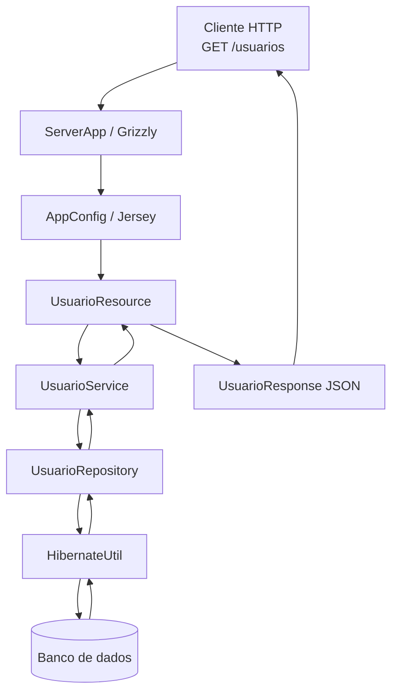

# api-bike

API Java para consulta de usuários, construída com **Jersey + Grizzly** na camada HTTP e **Hibernate** na camada de persistência.

O projeto expõe o endpoint `GET /usuarios`, consulta a tabela `usuario` no PostgreSQL e devolve os dados em formato JSON.

## Objetivo

Este projeto implementa uma API simples com separação por camadas:

- **Resource**: recebe a requisição HTTP
- **Service**: aplica a regra de negócio e transforma os dados
- **Repository**: acessa o banco via Hibernate
- **Entity / Response DTO**: representam os dados persistidos e o payload de saída

## Stack

- Java
- Maven
- Jersey (JAX-RS)
- Grizzly HTTP Server
- Hibernate ORM
- PostgreSQL
- Jackson para serialização JSON

## Configuração do banco

Arquivo de exemplo:

```properties  
# src/main/resources/hibernate.properties.example  
  
db.url=jdbc:postgresql://localhost:5432/bikes  
db.user=postgres  
db.password=postgres  
```  


## Endpoint disponível

### Listar usuários

```http  
GET /usuarios  
```  

Exemplo de chamada:

```bash  
curl http://localhost:8080/usuarios
```  

Exemplo de resposta esperada:

```json  
{  
  "usuarios": ["Ana", "Bruno", "Carlos"]}  
```  

## Fluxo da requisição

1. O servidor é iniciado por `Main`
2. `Main` delega a inicialização para `ServerApp`
3. `ServerApp` cria o servidor Grizzly com a configuração do Jersey definida em `AppConfig`
4. `AppConfig` registra os recursos JAX-RS
5. Uma requisição `GET /usuarios` chega em `UsuarioResource`
6. `UsuarioResource` chama `UsuarioService`
7. `UsuarioService` solicita os dados ao `UsuarioRepository`
8. `UsuarioRepository` abre uma `Session` via `HibernateUtil`
9. O Hibernate consulta a entidade `Usuario`
10. O resultado é transformado em `UsuarioResponse`
11. O Jackson serializa o DTO para JSON na resposta HTTP

## Arquitetura

O diagrama abaixo mostra as relações principais entre as classes do projeto.




## Responsabilidade de cada classe

### `Main`
Ponto de entrada da aplicação. Sobe o servidor e registra o shutdown hook.

### `ServerApp`
Inicializa e encerra o servidor HTTP com Grizzly.

### `AppConfig`
Configura o Jersey, define os pacotes a serem escaneados e registra o suporte a JSON.

### `UsuarioResource`
Camada HTTP da API. Expõe o endpoint `/usuarios`.

### `UsuarioService`
Camada de negócio. Orquestra a busca dos usuários e prepara os dados para resposta.

### `UsuarioRepository`
Camada de acesso a dados. Executa a consulta Hibernate para recuperar os registros da entidade `Usuario`.

### `HibernateUtil`
Centraliza a criação do `SessionFactory` e o carregamento das propriedades de conexão com o banco.

### `Usuario`
Entidade JPA/Hibernate mapeada para a tabela `usuario`.

### `UsuarioResponse`
DTO usado para estruturar a resposta JSON do endpoint.

## Observações importantes

- O endpoint `/usuarios` depende da tabela `usuario` estar populada.
- O projeto usa `hibernate.properties` para injetar credenciais sem fixá-las no código.
- Em ambiente de produção, evite versionar credenciais reais no repositório.  
  